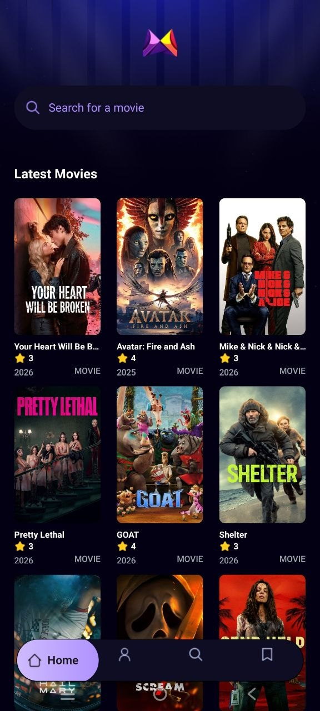

# 🎬 ReplayRealm

ReplayRealm is a stunning, modern movie discovery application built with Expo and React Native. Explore the latest blockbusters, discover trending films based on community searches, and dive deep into movie details—all wrapped in a beautiful, dark-themed UI.

<div align="center">
  
  &nbsp;
  
</div>

## ✨ Features

- **Trending Movies**: Discover what's hot right now. ReplayRealm tracks searches using an Appwrite backend to dynamically surface the most popular movies among users.
- **Latest Releases**: Browse through the newest and most popular movies powered by the TMDB API.
- **Deep Search**: Effortlessly find any movie you're looking for.
- **Comprehensive Details**: Get all the info you need about a movie, including poster art, ratings, runtime, overview, genres, budget, and production companies.
- **Premium UI/UX**: Crafted with NativeWind (Tailwind CSS for React Native) for a beautiful, responsive, and truly native feel, featuring dark mode aesthetics.

## 🛠️ Tech Stack

- **Framework**: [Expo](https://expo.dev/) & [React Native](https://reactnative.dev/)
- **Styling**: [NativeWind](https://www.nativewind.dev/) (Tailwind CSS)
- **Movie Data**: [TMDB API](https://developer.themoviedb.org/docs)
- **Backend/Database**: [Appwrite](https://appwrite.io/) (Tracks search analytics to generate the trending list)

## 🚀 Getting Started

Follow these steps to get ReplayRealm running on your local machine.

### Prerequisites

- Node.js installed
- Expo CLI or Expo Go app on your physical device (or a configured Android/iOS emulator)
- A TMDB API Key
- An Appwrite Project (for the trending feature)

### Installation

1. **Clone the repository** (if applicable) or navigate to the project directory:
   ```bash
   cd ReplayRealm
   ```

2. **Install dependencies**:
   ```bash
   npm install
   ```

3. **Configure Environment Variables**:
   Create a `.env` file in the root directory and add your required keys:
   ```env
   EXPO_PUBLIC_MOVIE_API_KEY=your_tmdb_api_key_here
   EXPO_PUBLIC_APPWRITE_PROJECT_ID=your_appwrite_project_id
   EXPO_PUBLIC_APPWRITE_DATABASE_ID=your_appwrite_database_id
   EXPO_PUBLIC_APPWRITE_COLLECTION_ID=your_appwrite_collection_id
   ```

4. **Start the app**:
   ```bash
   npx expo start
   ```

## 🤝 Contributing

Contributions, issues, and feature requests are welcome! Feel free to check the issues page.

## 📝 License

This project is licensed under the MIT License.
